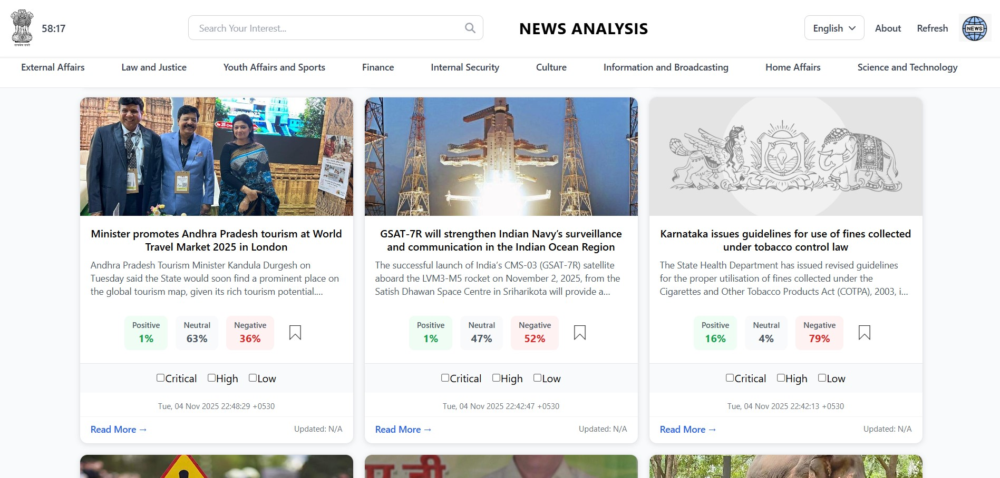
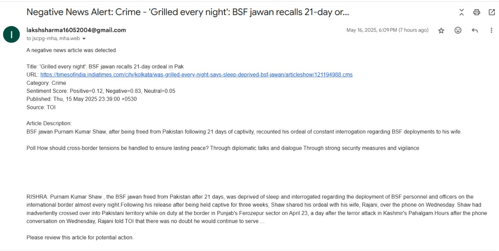
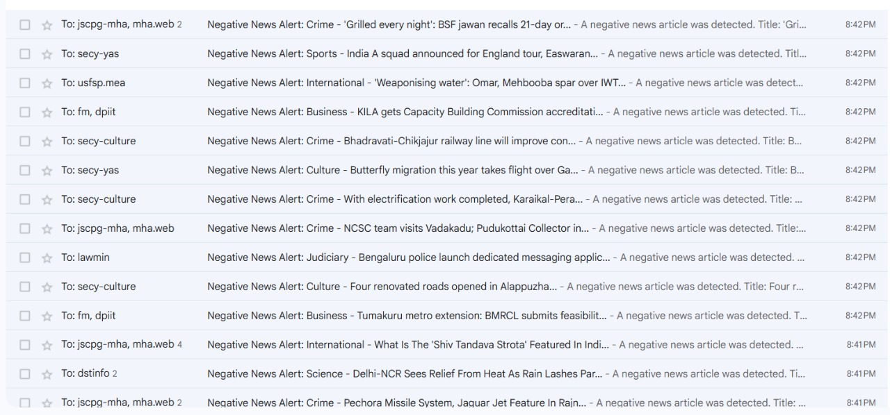

# 📡 News Intelligence & Alert System

> **📖 Setup Instructions:** See [SETUP.md](./SETUP.md) for detailed installation and configuration guide.

## 📌 Objective
This project is an end-to-end automated pipeline that:
- Extracts live digital news from major Indian news portals.
- Classifies news articles into relevant government ministries.
- Performs sentiment analysis to identify negative news.
- Sends real-time email alerts to the appropriate authorities.
- Provides a modern web-based interface for exploration and feedback.

## 🗞️ Data Collection
### 🔍 Sources:
- Times of India
- The Hindu
- News18 (English & Punjabi)
- Dainik Bhaskar
- AajTak
- India Today
- India TV
- Jagran
- Tribune
- Hindustan Times
- Indian Express
- And more regional news portals

### 🛠️ Crawling Tools:
- **Selenium**: For dynamic JavaScript content and video news extraction.
- **BeautifulSoup**: For static HTML parsing.
- **Scheduler**: Custom Python scripts using `schedule` and `threading`.
- **MoviePy**: For video processing and audio extraction.
- **SpeechRecognition API**: For Hindi-to-English transcription from video news.

### 📄 Data Fields Extracted:
- Headline
- Full article text
- Publish date
- News source
- Video transcription (for video news)

## 🧾 Dataset Description
- Language: Primarily English, with Hindi video news transcription support.
- Format: Text-based articles and transcribed video content.
- Video Processing: Automated extraction and transcription of video news using Selenium, MoviePy, and SpeechRecognition API with Google Translate integration.

## ⚙️ Description of Work Done
The full pipeline includes:
- Web Crawling using Selenium + BeautifulSoup
- Video News Processing using Selenium, MoviePy, and SpeechRecognition API
- Text Processing using SpaCy, NLTK, TF-IDF, SBERT
- Clustering & Classification using K-Means, HDBSCAN, DistilBERT
- Sentiment Analysis with RoBERTa and TextBlob
- Frontend using Next.js + Tailwind CSS
- Backend using Django REST Framework
- Alert System using Gmail SMTP

## 🧹 Data Preprocessing
- Lowercasing
- Removing punctuation, numbers, HTML
- Stopword removal
- Tokenization & Lemmatization using SpaCy
- Missing data handling:
  - Dropped empty entries
  - Imputed publish dates from metadata

## 🔍 Feature Engineering
### 📌 Text Embedding:
- TF-IDF
- Sentence-BERT (SBERT)

### 📌 Dimensionality Reduction:
- UMAP for 2D clustering visualizations

## 🧠 Algorithms Implemented

| Task                | Tools & Techniques                |
|---------------------|-----------------------------------|
| Web Crawling        | Selenium + BeautifulSoup          |
| Video Processing    | Selenium, MoviePy, SpeechRecognition|
| Preprocessing       | SpaCy, NLTK                       |
| Vectorization       | TF-IDF, SBERT                     |
| Clustering          | K-Means, HDBSCAN                  |
| Classification      | DistilBERT (Fine-tuned)           |
| Sentiment Analysis  | RoBERTa, TextBlob                 |
| Email Alerts        | Gmail SMTP                        |
| Frontend Development| Next.js + Tailwind CSS            |
| Backend Integration | Django REST Framework             |

## 🎯 Model Training

### Ministry Classification:
- **Model:** Fine-tuned DistilBERT
- **Labels:** 10 Government Ministries

#### Training:
- Epochs: 4
- Batch Size: 32
- Optimizer: AdamW
- Loss: Cross-Entropy

#### Evaluation:

| Metric    | Score |
|-----------|-------|
| Accuracy  | 83.2% |
| Precision | 0.81  |
| Recall    | 0.76  |
| F1-Score  | 0.79  |

## 😡 Sentiment Analysis

- **Models:** RoBERTa (CardiffNLP twitter-roberta-base-sentiment), TextBlob (baseline)
- **Classes:** Positive, Neutral, Negative
- **Alert Trigger:** Negative news → Email alert

## 📧 Feedback & Alert System

### Workflow:
News → Classified → Sentiment → Email

### Email Tech:
Gmail SMTP (Python smtplib)

### Email Content:
- Headline
- Summary
- Sentiment
- Source URL
- Recipients: Mapped government officials

## 🌐 Web Interface

### Frontend:
- Search headlines
- Filters: Sentiment, Ministry, Date
- Clustered news view
- Sentiment indicators (Red/Yellow/Green)

### Backend:
Django REST API with modules for:
- News fetching
- Classification
- Sentiment analysis
- Email alerts

## 🖼️ Screenshots

### Dashboard Example:

### Email Alert Example:

## 📊 Evaluation Parameters

| Parameter              | Value         |
|------------------------|---------------|
| Classification Accuracy| 83.2%         |
| Sentiment Accuracy     | 78.5%         |
| Clustering Silhouette  | 0.61          |
| Transcription Accuracy | 92% (English) |
| Email Delivery Time    | < 5 seconds   |
| API Response Time      | ~450 ms       |
| Frontend Load Time     | < 1.5 seconds |

## ✅ Results & Discussions
- Automated news crawling to alert system pipeline completed.
- Achieved high classification accuracy.
- Timely email alerts for negative news articles.
- Web interface allows live news exploration and user feedback.
- Video news processing and transcription pipeline implemented.

## 🚀 Future Enhancements
- Integration with social media (Twitter, Facebook)
- Graph-based clustering (e.g., Louvain, Leiden)
- Weekly insight reports for policy-makers
- Fake news detection module
- Android/iOS app for field use
- Voice-controlled admin panel
- Enhanced multilingual support (Hinglish, regional languages)
